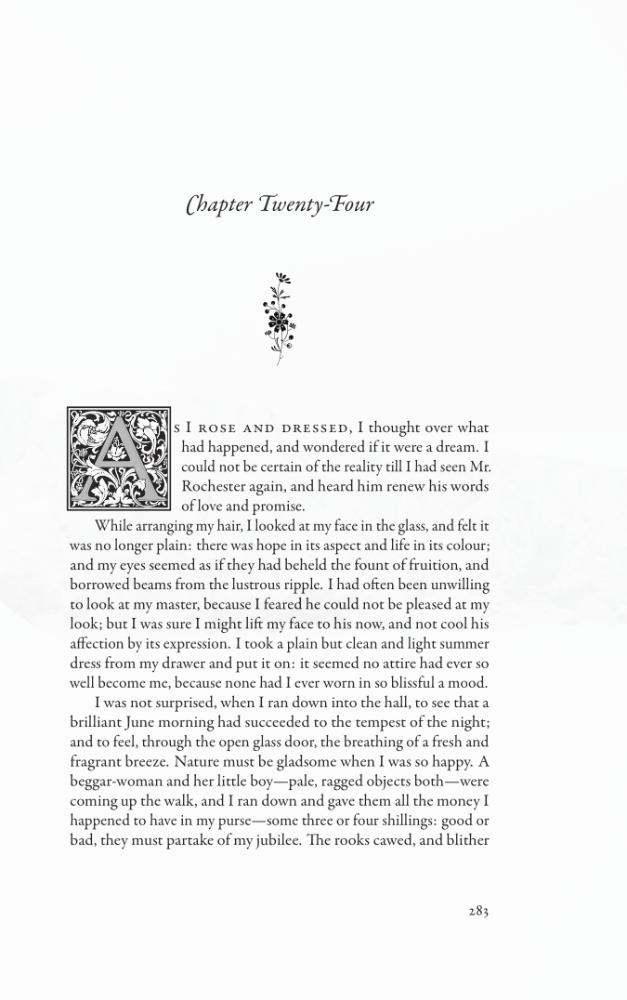

# Jane Eyre

This is Charlotte Bronte's *Jane Eyre* set in LuaTeX with digital tracings of F.H. Townsends illustrations on a stock size of 215x135 mm. The source files have been manually converted from the public domain source provided by [Project Gutenberg](https://www.gutenberg.org/ebooks/1260).

The full version is set in [*Garamond Premier Pro*](https://fonts.adobe.com/fonts/garamond-premier) with layered initials in [*LTC Goudy Initials*](https://www.p22.com/family-Goudy_Initials) and with ornaments from [*Vectorian*](https://www.vectorian.net/). It also includes an additional title page and a cover. Since these fonts and grapics require licenses, this version is instead set in *EB Garamond* without any additional ornaments.

The digital tracings have been created using [*potrace*](http://potrace.sourceforge.net/) (with varying success).

